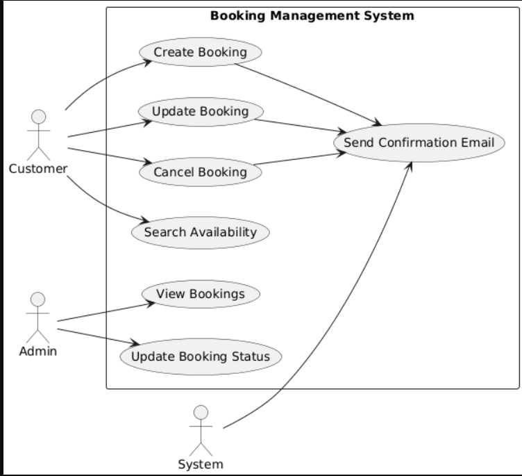

# Requirement Analysis in Software Development

## Introduction
This repository is dedicated to exploring the concept of **Requirement Analysis** in software development.  
Its purpose is to document the process, best practices, techniques, and tools involved in gathering and analyzing requirements before software design and implementation.  

By maintaining this repository, developers, students, and professionals can better understand how proper requirement analysis leads to building software that meets user needs, reduces costly errors, and improves project success rates.

---

## What is Requirement Analysis?
**Requirement Analysis** is the process of identifying, documenting, and managing the needs and expectations of stakeholders for a software system.  
It is one of the most critical phases in the **Software Development Life Cycle (SDLC)** because it lays the foundation for design, development, and testing.

### Importance of Requirement Analysis:
1. **Clear Understanding of Needs**  
   Ensures that developers, clients, and stakeholders have a shared understanding of what the system should achieve.

2. **Minimizes Errors and Rework**  
   Well-defined requirements reduce misunderstandings, scope creep, and costly redesigns later in the project.

3. **Improves Project Planning**  
   Accurate requirements help in estimating resources, costs, and timelines effectively.

4. **Enhances Quality**  
   Software that aligns with user requirements is more likely to be accepted and deliver real value.

5. **Acts as a Communication Bridge**  
   Requirement documents serve as a reference point between technical teams and business stakeholders.

In summary, Requirement Analysis is not just about gathering information—it’s about deeply understanding the problem, clarifying expectations, and creating a solid foundation for successful software development.

---

## Why is Requirement Analysis Important?
Requirement Analysis is a **cornerstone of successful software projects**. Its significance lies in ensuring that the right product is built, on time, and within budget. Some key reasons include:

1. **Prevents Project Failures**  
   Many software projects fail because of unclear or misunderstood requirements. Requirement Analysis reduces this risk by ensuring that the development team and stakeholders are aligned from the start.

2. **Saves Time and Costs**  
   Detecting and fixing errors during the requirement phase is far less expensive than making changes later during development or after deployment.

3. **Drives Customer Satisfaction**  
   By capturing user needs accurately, Requirement Analysis ensures that the final product meets or exceeds customer expectations, leading to higher acceptance and satisfaction.

In essence, without proper Requirement Analysis, projects are prone to delays, cost overruns, and dissatisfied users.

---

## Key Activities in Requirement Analysis
Requirement Analysis consists of several structured activities to ensure requirements are well understood and managed. The five key activities are:

- **Requirement Gathering**  
  Collecting initial information from stakeholders about what they expect from the system. This may include user interviews, surveys, questionnaires, or reviewing existing documentation.

- **Requirement Elicitation**  
  Engaging stakeholders through discussions, workshops, brainstorming, and prototyping to uncover their true needs, including hidden or unstated requirements.

- **Requirement Documentation**  
  Clearly recording the gathered requirements in an organized format such as Software Requirement Specification (SRS) documents, user stories, or use case diagrams.

- **Requirement Analysis and Modeling**  
  Examining the documented requirements for feasibility, completeness, and consistency. This may involve creating models like data flow diagrams, UML diagrams, or mock-ups to visualize how the system will work.

- **Requirement Validation**  
  Confirming that the documented requirements accurately reflect stakeholder needs and business goals. Validation ensures that requirements are testable, achievable, and aligned with project objectives.

---

## Types of Requirements
In software projects, requirements are generally categorized into **Functional Requirements** and **Non-functional Requirements**. Both are equally important to ensure a system is complete, usable, and effective.

### 1. Functional Requirements
Functional requirements describe **what the system should do** — the specific features, functions, and interactions the system must provide.

**Definition:**  
Functional requirements define the core operations, tasks, and behaviors of the system that directly support business needs.

**Examples for a Booking Management Project:**
- The system must allow users to create, update, and cancel bookings.  
- The system must send booking confirmation emails to customers.  
- The system must generate a booking reference number for each reservation.  
- The admin should be able to view all bookings and update booking statuses.  
- The system must allow customers to search for available dates, rooms, or services.  

---

### 2. Non-functional Requirements
Non-functional requirements describe **how the system should perform** — the quality attributes and constraints under which the system operates.

**Definition:**  
Non-functional requirements define performance, security, usability, and reliability expectations that enhance the user experience and system quality.

**Examples for a Booking Management Project:**
- The system should handle up to **500 concurrent users** without performance degradation.  
- The booking confirmation email must be sent within **30 seconds** of booking.  
- The system should be available **99.9% of the time** (high availability).  
- The system must encrypt sensitive customer data (e.g., payment details) using **AES-256** encryption.  
- The user interface should be responsive and accessible on **mobile, tablet, and desktop devices**.  

---

## Use Case Diagrams
A **Use Case Diagram** is a visual representation used in Requirement Analysis to capture the interactions between users (actors) and the system.  
It illustrates **what the system should do** from the perspective of end-users and helps stakeholders clearly understand system functionality.

### Benefits of Use Case Diagrams:
- Provide a **high-level view** of the system’s functionality.  
- Serve as a **communication tool** between stakeholders and developers.  
- Help in **identifying functional requirements** early in the SDLC.  
- Aid in clarifying **system boundaries** (what is inside vs outside the system).  

---

### Use Case Diagram for Booking Management System

**Actors:**
- **Customer** → Books, updates, and cancels reservations.  
- **Admin** → Manages bookings, updates statuses, views reports.  
- **System** → Sends booking confirmation and notifications.  

**Use Cases:**
- Create Booking  
- Update Booking  
- Cancel Booking  
- Search Availability  
- View Bookings (Admin)  
- Update Booking Status (Admin)  
- Send Confirmation Email (System)  

---

### Diagram
Below is the use case diagram for the booking system:

*(The diagram should be designed using PlantUML or Draw.io, exported as `alx-booking-uc.png`, and placed in the repository.)*

---

## Acceptance Criteria
**Acceptance Criteria** are a set of predefined conditions that a software product or feature must meet in order to be accepted by stakeholders, customers, or end-users.  
They act as a **benchmark** for validating whether a requirement has been implemented correctly and is functioning as expected.

### Importance of Acceptance Criteria in Requirement Analysis
- **Clarifies Expectations**: Ensures stakeholders, developers, and testers share a common understanding of what success looks like.  
- **Guides Development**: Developers know exactly what needs to be built and when the feature is considered "done."  
- **Supports Testing**: Provides the basis for test cases, ensuring that features are verifiable and measurable.  
- **Reduces Ambiguity**: Eliminates misunderstandings by defining precise conditions instead of vague requirements.  

---

### Example: Checkout Feature in Booking Management System
**Feature:** Checkout process for completing a booking.  

**Acceptance Criteria:**
1. The system must allow a customer to proceed to checkout only if they have a valid booking selection.  
2. The system must display a summary of the booking (date, time, service/room, and price) before payment.  
3. The customer must be able to enter payment details securely.  
4. The system must validate payment details and display an error message if the payment fails.  
5. On successful payment, the system must generate a booking confirmation number.  
6. A confirmation email must be sent to the customer within 30 seconds of successful checkout.  
7. The booking status must update to **“Confirmed”** in the system.  

---

👉 In short, **Requirement Analysis** is the foundation of building the right product. With proper requirement gathering, categorization, modeling, and validation, software projects are more likely to succeed, stay within budget, and deliver value to users.
